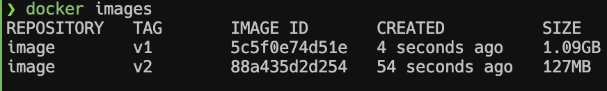

## Versão mais otimizada

Olhe na imagem abaixo a diferença de tamanho entre uma imagem otimizada e uma imagem base

Sigas os passos do dockerFile nessa pasta example02 para entender como fazer igual
